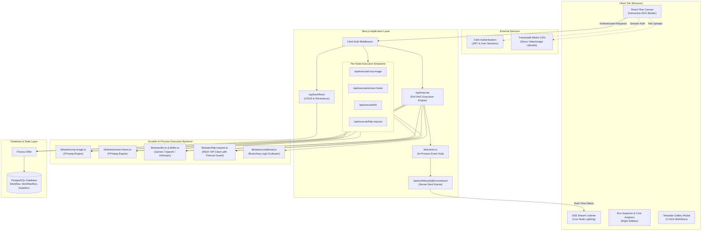
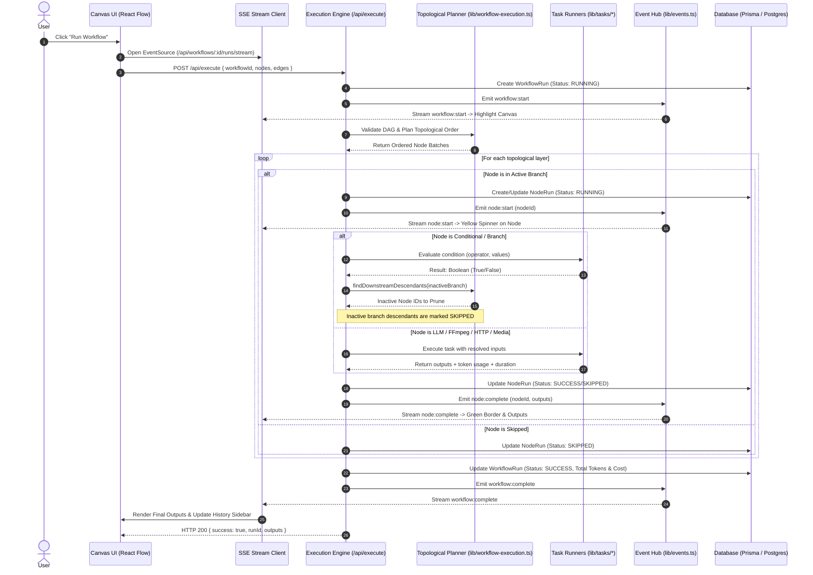

# Flowvy

**Flowvy** is a modern, extensible visual workflow builder for orchestrating AI and multimedia processing pipelines. Built on Next.js 14, React Flow, FFmpeg, and multi-provider LLM integrations (Google Gemini, OpenAI, Anthropic), Flowvy empowers developers and creators to design, test, branch, and deploy complex automation graphs in an intuitive node-based canvas.

---

## Architecture Overview

Flowvy connects a reactive front-end visual canvas to a resilient Next.js execution engine, database persistence layer, and external AI/multimedia services.



---

## Workflow Execution Sequence

When you click **Run Workflow**, Flowvy validates the Directed Acyclic Graph (DAG), detects topological execution layers, executes tasks concurrently, prunes inactive conditional branches, and streams real-time status updates to the client via Server-Sent Events (SSE).



---

## Node Types

Flowvy provides **8 modular, extensible node types** supporting media transformations, multi-model AI reasoning, external API integrations, and dynamic branching:

| Node Type | Category | Description | Key Inputs / Config | Outputs |
| :--- | :--- | :--- | :--- | :--- |
| **Text** | Input | Simple or formatted text source | Text value | `output` (text) |
| **Upload Image** | Media | Image upload via Transloadit or URL | Image URL / file upload | `output` (image URL / base64) |
| **Upload Video** | Media | Video upload via Transloadit or URL | Video URL / file upload | `output` (video URL) |
| **Run Any LLM** | AI & LLM | Multi-provider multimodal LLM processor | System Prompt, User Prompt, Images | `output` (text response) + Token/Cost usage |
| **Crop Image** | Media | FFmpeg visual crop tool | Image URL, X%, Y%, Width%, Height% | `output` (cropped image) |
| **Extract Frame** | Media | FFmpeg video keyframe extractor | Video URL, Timestamp (sec/%) | `output` (extracted frame image) |
| **HTTP Request** | Integration | Universal REST API & webhook client | Method (GET/POST/PUT/DEL), URL, Headers, Body | `output` (JSON / text payload), `status` |
| **Condition / Branch** | Logic | Dual-branch dynamic route evaluator | Value, Operator, Compare Value | `true` (passed branch), `false` (failed branch) |

### Multi-Provider LLM Details
- **Providers Supported**: Google Gemini, OpenAI, Anthropic Claude.
- **Models Supported**:
  - **Gemini**: `gemini-1.5-flash`, `gemini-1.5-flash-latest`, `gemini-2.0-flash`, `gemini-1.5-pro`
  - **OpenAI**: `gpt-4o-mini`, `gpt-4o`, `gpt-4-turbo`, `o1-mini`
  - **Anthropic**: `claude-3-5-sonnet-20241022`, `claude-3-5-haiku-20241022`, `claude-3-opus-20240229`
- **Multimodal**: Connects upstream image nodes directly into LLM image input handles.
- **Cost Analytics**: Calculates prompt tokens, completion tokens, and real-time execution cost ($ USD) per node and per run.

### Dynamic Branching & Inactive Path Pruning
- Supports comparison operators: `equals`, `not_equals`, `contains`, `not_contains`, `greater_than`, `less_than`, `is_empty`, and `is_not_empty`.
- If a condition evaluates to `True`, the execution planner automatically identifies all downstream descendants connected exclusively to the `False` handle and prunes them from the execution plan without failing the DAG.

---

## Features

- 🎨 **Visual Canvas**: Drag-and-drop React Flow canvas with dark mode, zoom, minimap, and animated connections.
- 📡 **Real-Time SSE Streaming**: Live Server-Sent Events stream node-by-node execution state directly to canvas node borders and badges.
- 📊 **Run History & Cost Inspector**: View lifetime token consumption, estimated USD spend, and drill into inputs, outputs, errors, and durations for every step.
- 📚 **Template Gallery & Library**: Curated starter templates and 1-click export/import for custom parameterized workflows with automatic UUID remapping.
- ⚡ **Concurrent DAG Execution**: Parallel branches run concurrently with cycle detection and type safety.
- 🚀 **Zero External Worker Setup**: Fast, durable in-process task execution backend eliminating external broker requirements during development and deployment.

---

## Tech Stack

- **Framework**: Next.js 14 (App Router, Server-Sent Events, API Routes)
- **Language**: TypeScript throughout
- **Database & ORM**: PostgreSQL via Prisma ORM (compatible with Supabase, Neon, or local Postgres)
- **Authentication**: Clerk Authentication
- **Graph & Canvas**: React Flow (@xyflow/react)
- **AI Providers**: Google Generative AI SDK, OpenAI SDK, Anthropic SDK
- **Multimedia Processing**: `fluent-ffmpeg` & `ffmpeg-static`
- **File Uploads**: Transloadit
- **Styling & State**: Tailwind CSS, Lucide React, Zustand

---

## Getting Started

### 1. Clone & Install
```bash
git clone https://github.com/Katakam-Krupavathi/flowvy.git
cd flowvy
npm install
```

### 2. Environment Variables
Copy `.env.example` to `.env` and configure your credentials:
```bash
cp .env.example .env
```

| Variable | Description | Source |
| :--- | :--- | :--- |
| `DATABASE_URL` | PostgreSQL pooled connection string (e.g., Supabase port 6543) | [Supabase](https://supabase.com) / [Neon](https://neon.tech) |
| `DIRECT_URL` | PostgreSQL direct session string (e.g., Supabase port 5432) | Supabase / Neon |
| `NEXT_PUBLIC_CLERK_PUBLISHABLE_KEY` | Clerk Publishable API Key | [Clerk Dashboard](https://clerk.com) |
| `CLERK_SECRET_KEY` | Clerk Secret API Key | Clerk Dashboard |
| `GOOGLE_AI_API_KEY` | Google Gemini API Key | [Google AI Studio](https://makersuite.google.com/app/apikey) |
| `OPENAI_API_KEY` | OpenAI API Key (optional for OpenAI models) | [OpenAI Platform](https://platform.openai.com) |
| `ANTHROPIC_API_KEY` | Anthropic API Key (optional for Claude models) | [Anthropic Console](https://console.anthropic.com) |
| `NEXT_PUBLIC_TRANSLOADIT_KEY` | Transloadit Auth Key | [Transloadit](https://transloadit.com) |
| `TRANSLOADIT_SECRET` | Transloadit Auth Secret | Transloadit |

### 3. Initialize Database
```bash
npx prisma generate
npx prisma db push
```

### 4. Run Development Server
```bash
npm run dev
```
Open [http://localhost:3000](http://localhost:3000) in your browser.

### 5. Run Verification Test Suite
```bash
npm test
```

---

## Security & Credential Hygiene

- **Strict Git Hygiene**: Secrets, passwords, API keys, and environment variables are **never** committed to version control.
- **Gitignore Safeguards**: `.env`, `.env.local`, and sensitive build artifacts are strictly ignored in `.gitignore`.
- **Automated Secret Scanner**: Run `npm run check:secrets` in CI/CD or before committing to verify zero hardcoded credentials or connection strings exist in the repository.
- **Database Connection Safety**: Refer to [DATABASE_SETUP.md](DATABASE_SETUP.md) for complete instructions on connection pooling, URL-encoding special characters in database passwords, and configuring direct vs. session pooler URLs.

---

## Roadmap

- [x] **Phase 0: Security & Redaction**
  - [x] Redact all committed credentials and connection strings with standard placeholders.
  - [x] Consolidate fragmented database guides into a single comprehensive [DATABASE_SETUP.md](DATABASE_SETUP.md).
  - [x] Add automated secret scanning script (`scripts/check-secrets.js`) to test suite.
- [x] **Phase 1: Full-Workflow Execution & FFmpeg Integration**
  - [x] Fix execution route to call underlying FFmpeg tasks for `cropImage` and `extractFrame`.
  - [x] Topological sort execution engine with cycle detection and input propagation.
- [x] **Phase 2: LLM Consolidation**
  - [x] Consolidate multimodal Gemini calling logic with automated fallback handling into `lib/llm.ts`.
- [x] **Phase 3: Durable Execution Backend**
  - [x] Replace fire-and-forget background routes with in-process execution tasks in `lib/tasks/`.
- [x] **Phase 4: Node Extensibility**
  - [x] Multi-Provider LLM node (Gemini, OpenAI, Anthropic Claude) with per-node configuration.
  - [x] Generic HTTP Request node with REST methods, custom headers, and JSON body parsing.
  - [x] Conditional / Branch node with 8 operators and topological DAG branch pruning.
- [x] **Phase 5: Real-Time Observability & Templates**
  - [x] Live execution status updates via Server-Sent Events (SSE).
  - [x] Token usage and cost tracking ($ USD) with lifetime metrics and per-node inspector.
  - [x] Reusable Workflow Template Schema, Curated Starter Gallery, and 1-Click Instantiation.
- [ ] **Phase 6: Future Capabilities**
  - [ ] Loop / Iteration nodes for batch processing lists of images/URLs.
  - [ ] Secure Python / JavaScript code evaluation sandbox.
  - [ ] Community Template Marketplace and Cloud Workflow Sharing.

---

## License

This project is licensed under the [MIT License](LICENSE).
